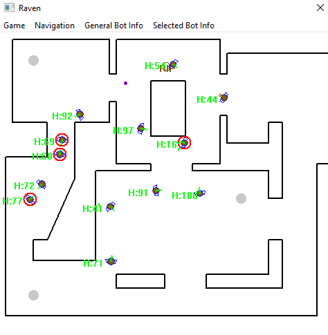

# Deep learning in Raven
## About The Project
It's based on a project of Mat Buckland : *"Raven"*.  

My goal was to add fuzzy logic and new weapons to the behavior of pre-trained agents so that they could adapt in real time.  

Agent aiming and shooting are modified by the deviation of a shot (bullet trajectory) with the following fuzzy variables: distance to target, velocity, and the period during which the target has remained visible.

  

## Gettin Started
### Usage
Some shortcuts to play at Raven :
| Shortcuts          | Function      |
| ------------------ | ------------- |
| Double Right Click | Possess a bot |
| Left Click         | Shoot         |

## License
Distributed under the MIT License. See `LICENSE` for more information.

## Contact
- Wesley Petit
- Sylvain Armand
- Guillaume Ruer
- Alexandre Martin
- Arnaud Szymanek

## Credits
- [Mat Buckland, *"Programming Game AI by Example"*, Chapter 7 to 10](http://www.ai-junkie.com/books/toc_pgaibe.html).
